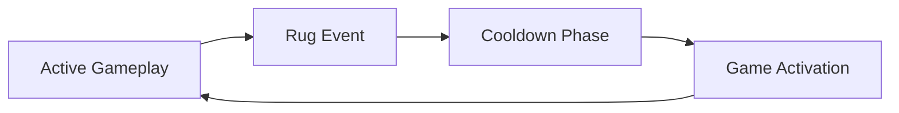

# Rugs.fun WebSocket Complete Integration Guide

## Table of Contents

1. [Overview](#overview)
2. [Connection Configuration](#connection-configuration)
3. [Critical Warnings](#critical-warnings)
4. [Game Architecture](#game-architecture)
5. [Event Types and Structures](#event-types-and-structures)
6. [Field Glossary](#field-glossary)
7. [Implementation Patterns](#implementation-patterns)
8. [Memory Management](#memory-management)
9. [Provably Fair System](#provably-fair-system)
10. [Testing and Validation](#testing-and-validation)

## Overview

This document provides the complete specification for connecting to Rugs.fun backend and handling real-time game data. It consolidates all critical WebSocket integration details, event structures, and implementation patterns.

## Connection Configuration

### WebSocket Server Details

```javascript
const socket = io('https://backend.rugs.fun', {
    reconnection: true,
    reconnectionAttempts: 5,
    reconnectionDelay: 1000,
    reconnectionDelayMax: 5000,
    timeout: 20000,
    transports: ['websocket', 'polling']
});
```

- **Protocol**: Socket.io v4.x
- **Transport**: WebSocket with polling fallback
- **Authentication**: Not required for read-only access
- **Server**: `https://backend.rugs.fun`

## Critical Warnings

### ⚠️ CRITICAL: Listen-Only Connection

**DO NOT emit any events or send responses to the server**. The connection has anti-bot authentication mechanisms that will immediately block/error your connection if you attempt to:

- Emit any events (e.g., `socket.emit()`)
- Send acknowledgments
- Respond to server messages
- Attempt any bidirectional communication

**This is a READ-ONLY feed. Listen to events only. No responses.**

### ⚠️ Practice Trade Filtering

**CRITICAL**: Always check the `coinAddress` field in trade events:
- `coinAddress === null` = Real SOL trade (include in calculations)
- `coinAddress !== null` (string value) = Practice/free trade (MUST exclude from all aggregates)

## Game Architecture

### Complete Game Loop (4-Phase Infinite Cycle)



**Flow:** `ACTIVE GAMEPLAY` → `RUG EVENT` → `COOLDOWN` → `GAME ACTIVATION` → **REPEAT**

### Phase Timing & Characteristics

| Phase | Duration | Key Indicator | Event Type | Purpose |
|-------|----------|---------------|------------|---------|
| **1. Active Gameplay** | Variable (1-5000 ticks) | `active: true` + `tickCount > 0` | `gameStateUpdate` | Live trading |
| **2. Rug Event** | Instant (dual events) | `gameHistory` appears | `gameStateUpdate × 2` | Provably fair seed reveal |
| **3. Cooldown Phase** | 15 seconds total | `cooldownTimer: 15000 → 0` | Mixed events | Settlement period |
| └ *Liquidation Buffer* | 15-10 seconds | `cooldownTimer > 10000ms` | `newTrade` (sells only) | Force liquidation |
| └ *Presale Window* | 10-0 seconds | `allowPreRoundBuys: true` | `gameStateUpdate` | Pre-entry at 1.0x |
| **4. Game Activation** | Instant | `active: true` + `tickCount: 0` | `gameStateUpdate` | Fresh game start |

### Game Parameters (from PRNG)

```javascript
const GAME_PARAMS = {
  STARTING_PRICE: 1.0,
  RUG_PROB: 0.005,              // 0.5% per tick
  TICK_MS: 250,                 // 250ms per tick
  MIN_VALID_TICKS: 1,
  MAX_TICKS: 5000,
  DRIFT_MIN: -0.02,             // -2% per tick
  DRIFT_MAX: 0.03,              // +3% per tick
  BIG_MOVE_CHANCE: 0.125,       // 12.5%
  GOD_CANDLE_CHANCE: 0.00001    // 0.001% (v3+)
};
```

## Event Types and Structures

### Primary Events (Must Track)

#### 1. `gameStateUpdate`

The primary event for complete game state monitoring.

**Full Event Structure:**
```javascript
{
  // Phase Control
  active: true,                    // Active gameplay phase
  rugged: false,                   // Game has rugged
  allowPreRoundBuys: false,        // Presale enabled
  cooldownTimer: 0,                // Milliseconds remaining in cooldown
  
  // Game Data
  gameId: "20250618-7117f09a...", // Unique game identifier
  gameVersion: "v3",               // Game logic version
  tickCount: 125,                  // Current game tick
  price: 1.45,                     // Current multiplier
  tradeCount: 48,                  // Total trades this game
  connectedPlayers: 234,           // Connected players
  
  // Historical Data
  candles: [...],                  // OHLC candle array
  currentCandle: {...},            // Currently forming candle
  leaderboard: [...],              // Top 10 players with P&L
  
  // Provably Fair
  provablyFair: {
    serverSeedHash: "abc123...",   // Hash commitment
    version: "v3"
  },
  
  // Statistics
  averageMultiplier: 1.85,         // Rolling average
  peakMultiplier: 2.47,            // Highest this game
  
  // ONLY during rug events
  gameHistory: [...]               // Last 10 games with revealed seeds
}
```

#### 2. `newTrade`

Individual trade notifications.

**Event Structure:**
```javascript
{
  username: "player123",   // Player's display name
  type: "buy",            // "buy" or "sell"
  qty: 1.50,              // Amount in SOL (0.001 - 5.0)
  coinAddress: null       // null = real SOL, string = practice mode
}
```

#### 3. `playerUpdate`

Player-specific status updates (if authenticated).

**Event Structure:**
```javascript
{
  cash: 0,                // SOL balance
  bonusBalance: 0,        // Bonus balance
  positionQty: 0,         // Current position
  avgCost: 0,             // Average entry cost
  authenticated: false,   // Session status
  levelInfo: {...},       // XP progression
  crateKeys: {...}        // Reward keys
}
```

### Ignored Events (Do Not Track)

❌ **Non-Core Game Mechanics:**
- `History` - Chat history batches
- `tournamentUpdate` - Tournament system
- `crateInfo` - Reward crate system
- `newChatMessage` - Individual chat messages
- `newSideBet` - Experimental side-betting
- `goldenHourUpdate` - Special events
- `maintenanceUpdate` - Server maintenance
- `leaderboardData` - Statistical data

### Critical Error Corrections

- **`tradeEvent`:** **DOES NOT EXIST** - documentation error
- **`RUG_PROB`:** Not a real event type
- **`prngCallCount`:** Not a canonical event

> **Only `newTrade` is official** - any reference to `tradeEvent` must be corrected.

## Field Glossary

### Core Game State Fields

| Field | Type | Description |
|-------|------|-------------|
| `active` | Boolean | Whether game is in active phase |
| `allowPreRoundBuys` | Boolean | Indicates presale phase is active |
| `averageMultiplier` | Number | Rolling average from last 100 games |
| `candles` | Array | Historical OHLC candle data |
| `connectedPlayers` | Number | Total connected players |
| `cooldownTimer` | Number | Milliseconds remaining in cooldown |
| `currentCandle` | Object | Currently forming candle data |
| `gameHistory` | Array | **Only appears during rug events** |
| `gameId` | String | Unique identifier for current session |
| `gameVersion` | String | Game logic version identifier |
| `peakMultiplier` | Number | Highest multiplier achieved |
| `price` | Number | Current game price/multiplier |
| `provablyFair` | Object | Cryptographic verification data |
| `rugged` | Boolean | Whether game has been rugged |
| `serverSeed` | String | Revealed seed for verification |
| `serverSeedHash` | String | SHA-256 hash of server seed |
| `tickCount` | Number | Current game tick count |
| `tradeCount` | Number | Total trades in current game |
| `trades` | Array | Recent trade data |

### Player-Specific Fields

| Field | Type | Description |
|-------|------|-------------|
| `avgCost` | Number | Player's average cost basis |
| `hasActiveTrades` | Boolean | Player has open positions |
| `id` | String | Player's unique identifier |
| `level` | Number | Player's experience level |
| `pnl` | Number | Player's profit/loss in SOL |
| `positionQty` | Number | Quantity of tokens/shares held |
| `totalInvested` | Number | Total SOL invested |
| `username` | String | Player's display name |

### Trade Fields

| Field | Type | Description |
|-------|------|-------------|
| `cost` | Number | Total SOL cost of trade |
| `qty` | Number | Quantity traded |
| `tickIndex` | Number | Game tick when trade occurred |
| `timestamp` | Number | Unix timestamp (milliseconds) |
| `type` | String | Trade direction ("buy" or "sell") |

## Implementation Patterns

### Phase Detection Logic

```javascript
function detectGamePhase(data) {
  // RUGGED - Most specific, check first
  if (data.gameHistory && Array.isArray(data.gameHistory)) {
    if (data.active === true && data.rugged === true) {
      return "RUG_EVENT_1_SEED_REVEAL";
    }
    if (data.active === false && data.rugged === true) {
      return "RUG_EVENT_2_NEW_GAME_SETUP";
    }
  }
  
  // PRESALE
  if (data.cooldownTimer > 0 && data.cooldownTimer <= 10000 && 
      data.allowPreRoundBuys === true) {
    return "PRESALE_PHASE";
  }
  
  // COOLDOWN (post-rug, pre-presale)
  if (data.cooldownTimer > 10000 && data.rugged === true && 
      data.active === false) {
    return "COOLDOWN_PHASE";
  }
  
  // ACTIVE
  if (data.active === true && data.tickCount > 0 && 
      data.tradeCount > 0) {
    return "ACTIVE_GAMEPLAY";
  }
  
  // GAME STARTING
  if (data.active === true && data.tickCount === 0) {
    return "GAME_ACTIVATION";
  }
  
  return "UNKNOWN_PHASE";
}
```

### Trade Filtering

```javascript
function processNewTrade(tradeData) {
  // CRITICAL: Filter practice trades
  if (tradeData.coinAddress !== null) {
    console.log(`Practice trade ignored: ${tradeData.username}`);
    return;
  }
  
  // Process only real SOL trades
  const trade = {
    username: tradeData.username,
    type: tradeData.type,
    qty: tradeData.qty,
    timestamp: Date.now()
  };
  
  // Validate trade limits
  if (trade.qty < 0.001 || trade.qty > 5.0) {
    console.error(`Invalid trade amount: ${trade.qty} SOL`);
    return;
  }
  
  // Add to history and update UI
  memoryManager.addTrade(trade);
  updateTradeDisplay(trade);
}
```

### Trade Classification

#### Real SOL Trades
- `coinAddress === null`
- Minimum: 0.001 SOL
- Maximum: 5.0 SOL
- Affects game statistics
- Included in leaderboard calculations

#### Practice/Free Trades
- `coinAddress` contains a string value
- No SOL risk/reward
- **MUST BE EXCLUDED** from:
  - Position calculations
  - P&L tracking
  - Statistical aggregates
  - Risk assessments

### Rug Risk Calculation

```javascript
function calculateRugRisk(tickCount, price, gameHistory) {
  let risk = 0;
  
  // Base risk from tick progression
  if (tickCount > 0) {
    risk = Math.min(tickCount / 300, 0.4);
  }
  
  // Critical tick thresholds
  if (tickCount > 100) risk = Math.max(risk, 0.6);
  if (tickCount > 200) risk = Math.max(risk, 0.8);
  if (tickCount > 250) risk = Math.max(risk, 0.9);
  
  // Consider historical patterns if available
  if (gameHistory && gameHistory.length >= 10) {
    const avgDuration = gameHistory.reduce((sum, game) => 
      sum + game.duration, 0) / gameHistory.length;
    
    if (tickCount > avgDuration) {
      risk = Math.max(risk, 0.7);
    }
  }
  
  return Math.min(risk, 0.95);
}
```

## Memory Management

### Recommended Storage

- **Trade History**: Rolling buffer of ALL trades (not just 15-20)
- **Game History**: Minimum 100 complete games
- **Candle Data**: Store for pattern analysis
- **Leaderboard Snapshots**: End-of-game positions

```javascript
class MemoryManager {
  constructor() {
    this.games = [];          // Store 100+ games
    this.trades = [];         // All trades for current game
    this.maxGames = 100;      // Minimum recommendation
  }
  
  addGame(gameData) {
    this.games.push({
      id: gameData.gameId,
      peakMultiplier: gameData.peakMultiplier,
      duration: gameData.tickCount,
      trades: [...this.trades],
      timestamp: Date.now()
    });
    
    // Maintain rolling buffer
    if (this.games.length > this.maxGames) {
      this.games.shift();
    }
    
    // Clear trades for new game
    this.trades = [];
  }
  
  addTrade(trade) {
    // ONLY store real SOL trades
    if (trade.coinAddress === null) {
      this.trades.push({
        ...trade,
        timestamp: Date.now()
      });
    }
  }
}
```

## Provably Fair System

### Pre-Game
- Server publishes `serverSeedHash` in `provablyFair` object
- This is SHA-256 hash of secret seed

### Post-Game (Rug Event)
- `gameHistory[0].provablyFair.serverSeed` reveals actual seed
- Players can verify: `SHA256(serverSeed) === serverSeedHash`
- Game outcome deterministic from `serverSeed + gameId`

## Testing and Validation

### Implementation Checklist

#### Bot Development Requirements

- [ ] **Event Filtering:** Only track primary events (`gameStateUpdate`, `newTrade`, `playerUpdate`)
- [ ] **Phase Detection:** Implement robust phase detection logic
- [ ] **Rug Event Handling:** Capture dual `gameStateUpdate` events during rug phase
- [ ] **Seed Verification:** Store and verify `serverSeed` reveals
- [ ] **Position Tracking:** Monitor player positions via `leaderboard` and `playerUpdate`
- [ ] **Risk Management:** Implement liquidation buffer awareness
- [ ] **Presale Strategy:** Handle pre-round buy opportunities

#### Testing Checklist

- [ ] Practice trades excluded from calculations
- [ ] Real SOL trades properly tracked
- [ ] All game phases detected correctly
- [ ] Dual rug events captured
- [ ] Presale phase allows only buys
- [ ] Memory stores 100+ games
- [ ] Trade limits enforced (0.001-5.0 SOL)
- [ ] Provably fair seeds captured and stored
- [ ] Cooldown timer tracked accurately
- [ ] Game resets detected properly

### Critical Success Factors

1. **Accurate Phase Detection:** Essential for proper bot behavior
2. **Event Deduplication:** Handle potential duplicate events
3. **Latency Optimization:** Minimize processing delays
4. **Error Recovery:** Robust handling of connection issues
5. **Data Validation:** Verify event integrity and consistency

## Critical Implementation Notes

1. **Always filter practice trades** - Check `coinAddress === null`
2. **Track complete game cycles** - Don't reset on disconnect
3. **Store revealed seeds** - For provably fair verification
4. **Monitor presale positions** - Via leaderboard during presale phase
5. **Handle dual rug events** - Both events needed for complete data
6. **Respect trading limits** - 0.001 to 5.0 SOL only
7. **Maintain extensive history** - 100+ games recommended

---

*This document serves as the complete reference for Rugs.fun WebSocket integration and trading bot development.*