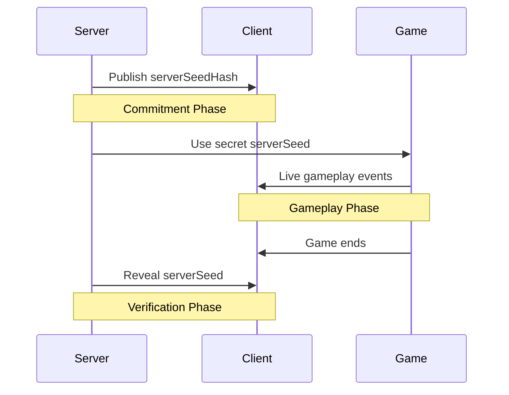
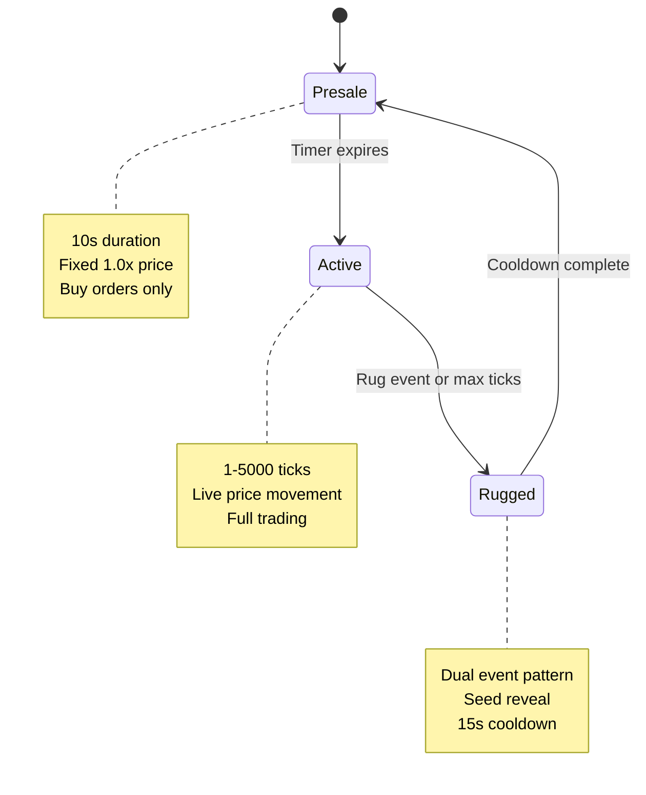

# Unified Game Mechanics & Provably Fair System

## Introduction

This document provides comprehensive knowledge of Rugs.fun's core mechanics, game parameters, provably fair system, and state machine. It serves as the foundational reference for the Karpit Bomber (KB) agent and strategic validation systems.

> **Companion Document:** This pairs with the authoritative `gameStateUpdate` event documentation for complete system understanding.

## 🎮 Game Parameters

### ⚠️ Critical Parameter Source Clarification

**Important:** The parameters below are **NOT directly readable** from live WebSocket events. They are **constants derived from game source code** that drive the events but are not broadcast in real-time.

**Usage:**
- **Post-game verification** after seed reveal
- **Predictive modeling** of game mechanics  
- **Outcome validation** using revealed seeds

### Core Game Constants

| Parameter | Value | Description |
|-----------|-------|-------------|
| `STARTING_PRICE` | `1.0` | Game starting multiplier |
| `RUG_PROB` | `0.005` (0.5%) | Probability per tick of game termination |
| `TICK_MS` | `250` | Milliseconds per game tick |
| `MIN_VALID_TICKS` | `1` | Minimum ticks for valid game |
| `MAX_TICKS` | `5000` | Maximum ticks per game |
| `TICKS_PER_CANDLE` | `5` | Ticks aggregated per visual candle |

### Price Movement Parameters

| Parameter | Value | Description |
|-----------|-------|-------------|
| `DRIFT_MIN` | `-0.02` (-2%) | Minimum price drift per tick |
| `DRIFT_MAX` | `0.03` (3%) | Maximum price drift per tick |
| `BIG_MOVE_CHANCE` | `0.125` (12.5%) | Probability of significant move |
| `BIG_MOVE_MIN` | `0.15` (15%) | Minimum big move size |
| `BIG_MOVE_MAX` | `0.25` (25%) | Maximum big move size |

### Version 3+ Features

| Parameter | Value | Description |
|-----------|-------|-------------|
| `GOD_CANDLE_CHANCE` | `0.00001` (0.001%) | Probability of massive price jump |
| `GOD_CANDLE_MOVE` | `10.0` | God candle multiplier |

### Trading & Economic Parameters

| Parameter | Value | Description |
|-----------|-------|-------------|
| `MAX_BET_SOL` | `5` | Maximum bet amount (SOL) |
| `TRADE_FEE` | `0` | Trading fee percentage |
| `PRESALE_DURATION` | `10s` | Presale phase length |
| `COOLDOWN_DURATION` | `~15s` | Inter-game cooldown |

## 🔐 Provably Fair System

### System Overview

Rugs.fun uses cryptographic commitment to ensure transparent, verifiable game outcomes:



### Verification Process

1. **Pre-Game Commitment**
   - Server generates secret `Server Seed`
   - Publishes SHA-256 hash (`Server Seed Hash`) in `gameStateUpdate.provablyFair`

2. **Gameplay Execution**
   - PRNG uses secret seed + `Game ID`
   - All events determined by this algorithm

3. **Post-Game Verification**
   - Server reveals original `Server Seed` in `gameHistory[0].provablyFair`
   - Players verify hash matches commitment
   - Recalculate game outcome independently

### Verification Inputs

| Input | Source | Description |
|-------|--------|-------------|
| **Server Seed** | `gameHistory[0].provablyFair.serverSeed` | Revealed after game ends |
| **Game ID** | `gameStateUpdate.gameId` | Unique game identifier |
| **Version** | `gameHistory[0].gameVersion` | Algorithm version (e.g., "v3") |

## 🧮 Core Algorithm Implementation

### Price Drift Function

```javascript
function driftPrice(
    price,
    DRIFT_MIN,
    DRIFT_MAX, 
    BIG_MOVE_CHANCE,
    BIG_MOVE_MIN,
    BIG_MOVE_MAX,
    randFn,
    version = 'v3',
    GOD_CANDLE_CHANCE = 0.00001,
    GOD_CANDLE_MOVE = 10.0,
    STARTING_PRICE = 1.0
) {
    // God Candle Check (v3+)
    if (version === 'v3' && randFn() < GOD_CANDLE_CHANCE && price <= 100 * STARTING_PRICE) {
        return price * GOD_CANDLE_MOVE;
    }
    
    let change = 0;
    
    // Big Move vs Normal Drift
    if (randFn() < BIG_MOVE_CHANCE) {
        const moveSize = BIG_MOVE_MIN + randFn() * (BIG_MOVE_MAX - BIG_MOVE_MIN);
        change = randFn() > 0.5 ? moveSize : -moveSize;
    } else {
        const drift = DRIFT_MIN + randFn() * (DRIFT_MAX - DRIFT_MIN);
        const volatility = version === 'v1' 
            ? 0.005 * Math.sqrt(price)
            : 0.005 * Math.min(10, Math.sqrt(price)); // v2/v3 cap volatility
        change = drift + (volatility * (2 * randFn() - 1));
    }
    
    let newPrice = price * (1 + change);
    return newPrice < 0 ? 0 : newPrice;
}
```

### Complete Game Verification

```javascript
function verifyGame(serverSeed, gameId, version = 'v3', gameParams) {
    const { 
        RUG_PROB, DRIFT_MIN, DRIFT_MAX, 
        BIG_MOVE_CHANCE, BIG_MOVE_MIN, BIG_MOVE_MAX,
        GOD_CANDLE_CHANCE, GOD_CANDLE_MOVE, 
        STARTING_PRICE, MAX_TICKS 
    } = gameParams;

    // Initialize PRNG with combined seed
    const combinedSeed = serverSeed + '-' + gameId;
    const prng = new Math.seedrandom(combinedSeed);
    
    let price = STARTING_PRICE;
    let peakMultiplier = STARTING_PRICE;
    let rugged = false;
    let tick = 0;
    
    // Simulate complete game
    for (tick = 0; tick < MAX_TICKS && !rugged; tick++) {
        // Check for rug event
        if (prng() < RUG_PROB) {
            rugged = true;
            continue;
        }
        
        // Calculate price movement
        price = driftPrice(
            price, DRIFT_MIN, DRIFT_MAX, BIG_MOVE_CHANCE, 
            BIG_MOVE_MIN, BIG_MOVE_MAX, prng.bind(prng), version,
            GOD_CANDLE_CHANCE, GOD_CANDLE_MOVE, STARTING_PRICE
        );
        
        // Track peak multiplier
        if (price > peakMultiplier) peakMultiplier = price;
        
        // Check for price floor
        if (price <= 0.00000001) break;
    }
    
    return {
        peakMultiplier: peakMultiplier / STARTING_PRICE,
        rugged: rugged,
        finalTick: tick
    };
}
```

## 🎯 Game State Machine

### Phase Progression



### 1. Presale Phase

**Characteristics:**
- **Duration:** 10 seconds
- **Price:** Fixed at 1.0x multiplier
- **Trading:** Buy orders only, no selling
- **Detection:** `allowPreRoundBuys === true` && `cooldownTimer > 0`

**KB Agent Actions:**
- Monitor pre-round activity
- Evaluate entry opportunities
- Prepare position sizing strategy

### 2. Active Phase

**Characteristics:**
- **Duration:** Variable (1-5000 ticks, 250ms each)
- **Price:** Live PRNG-driven movement
- **Trading:** Full buy/sell capabilities
- **Detection:** `active === true` && `rugged === false`

**KB Agent Actions:**
- Continuous risk evaluation
- Execute trading strategies
- Validate models against live data
- Monitor tick progression

### 3. Rugged Phase

**Characteristics:**
- **Duration:** Instant (dual-event pattern)
- **Purpose:** Game conclusion and seed reveal
- **Detection:** `gameHistory` object appears

**Dual Event Pattern:**

#### Event 1: Seed Reveal
- `active: true`, `rugged: true`
- Reveals `serverSeed` in `gameHistory[0]`
- Same `gameId` as completed game

#### Event 2: New Game Setup  
- `active: false`, `rugged: true`
- Provides `serverSeedHash` for next game
- New `gameId` for upcoming game
- Initiates `cooldownTimer`

**KB Agent Actions:**
- Log final game outcome
- Account for position settlements
- Verify game outcome using revealed seed
- Prepare for next game cycle

## 📊 Event Relationships

### Primary Events (Must Track)

| Event | Purpose | Frequency | Critical Data |
|-------|---------|-----------|---------------|
| `gameStateUpdate` | Main game state | ~250ms active | Phase control, `gameHistory` |
| `newTrade` | Individual trades | Real-time | Position tracking |
| `playerUpdate` | Player status | State changes | Balance, authentication |

### Event Data Cross-References

- **Candles ↔ Ticks:** Each candle = 5 ticks of price data
- **Game Outcome ↔ Seeds:** `serverSeedHash` (pre-game) + `serverSeed` (post-game)
- **Positions ↔ Trades:** `leaderboard` reflects cumulative `newTrade` events

## 🏆 Reward Systems (Optional Tracking)

### Crate System
- **Mechanism:** Tiered reward crates earned through gameplay
- **Event:** `crateInfo` (ignored for core trading)
- **Types:** tier0 (Iron) through tier9, referral crates

### XP & Levels
- **Mechanism:** Experience points from betting activity
- **Tracking:** `playerUpdate.levelInfo`
- **Purpose:** Player progression, cosmetic rewards

### Referral System
- **Mechanism:** Special crates when referred players reach milestones
- **Relevance:** Minimal impact on core trading strategy

## 🤖 KB Agent Operational Framework

### 4-Layer Architecture

#### 1. Data Ingestion & Processing
- **Input:** Real-time WebSocket events
- **Validation:** Event integrity and consistency
- **Filtering:** Primary events only

#### 2. Feature Engineering
- **Derived Metrics:** Volatility, momentum, risk indicators
- **Historical Analysis:** Pattern recognition
- **Real-time Calculations:** Position sizing, risk assessment

#### 3. Strategy Inference & Decision Making
- **Models:** Predictive algorithms and strategy logic
- **Risk Management:** Position limits, stop-loss triggers
- **Opportunity Detection:** Entry/exit signal generation

#### 4. Real-Time Execution & Action
- **Trade Execution:** Low-latency order placement
- **Position Management:** Dynamic adjustment
- **Performance Analysis:** Strategy validation and reporting

### Implementation Priorities

1. **Event Processing:** Robust WebSocket handling
2. **Phase Detection:** Accurate state machine tracking  
3. **Risk Management:** Position and capital protection
4. **Verification:** Post-game outcome validation
5. **Strategy Optimization:** Continuous model improvement

---

*This document provides the complete foundation for advanced Rugs.fun trading systems and strategic analysis.*