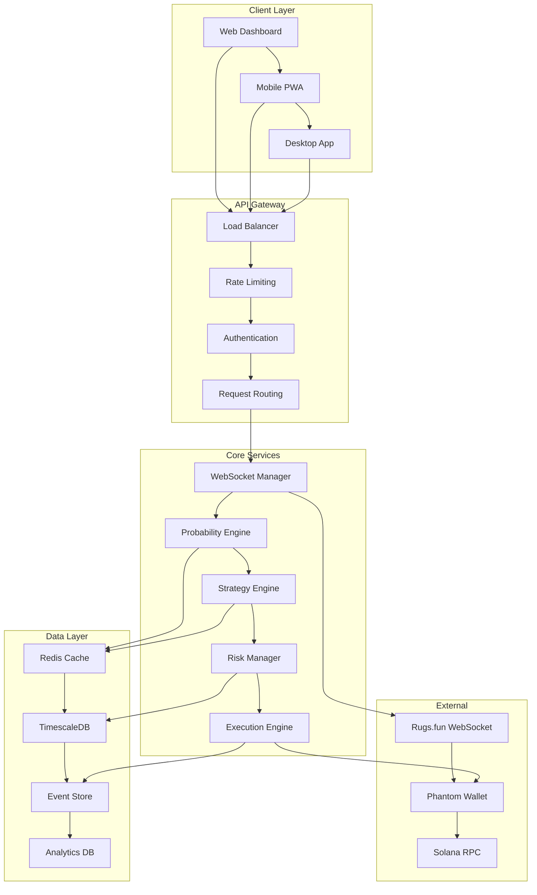

# 07 - System Architecture: Complete Technical Stack

## Executive Summary
This document defines the complete technical architecture for the Rugs.fun side betting decision support system. The architecture prioritizes real-time performance, mathematical precision, and scalable reliability while accommodating the critical timing variance discoveries and adaptive probability models established in previous documentation.

## Architecture Principles
- **Real-time First**: Sub-50ms decision support with adaptive timing compensation
- **Mathematical Precision**: 6+ decimal accuracy for all financial calculations
- **Fault Tolerance**: Graceful degradation during server anomalies
- **Horizontal Scaling**: Component-based architecture supporting growth
- **Security by Design**: Multi-layer protection for financial operations

---

## System Overview

### 1. High-Level Architecture



### 2. Component Responsibility Matrix

| Component | Primary Responsibility | Performance SLA | Scaling Strategy |
|-----------|----------------------|-----------------|------------------|
| **WebSocket Manager** | Real-time event processing | <10ms latency | Horizontal pods |
| **Probability Engine** | Adaptive calculations | <5ms compute | CPU-optimized |
| **Strategy Engine** | Decision algorithms | <15ms analysis | Stateless scaling |
| **Risk Manager** | Portfolio protection | <20ms validation | Memory-intensive |
| **Execution Engine** | Trade automation | <50ms end-to-end | Dedicated instances |

---

## Core Service Architecture

### 1. WebSocket Management Service

#### 1.1 Service Architecture
```typescript
interface WebSocketServiceConfig {
  rugsConnection: {
    url: string;
    reconnectAttempts: number;
    heartbeatInterval: number;
    bufferSize: number;
  };
  eventProcessing: {
    maxConcurrency: number;
    queueSize: number;
    batchSize: number;
    timeoutMs: number;
  };
  timingCompensation: {
    enabled: boolean;
    adaptationRate: number;
    reliabilityThreshold: number;
  };
}

class WebSocketManagementService {
  private connections: Map<string, WebSocketConnection>;
  private eventProcessor: EventProcessor;
  private timingEngine: AdaptiveProbabilityEngine;
  private healthMonitor: ConnectionHealthMonitor;
  private messageQueue: PriorityQueue<WebSocketEvent>;
  
  constructor(config: WebSocketServiceConfig) {
    this.initializeConnections(config);
    this.setupEventProcessing(config);
    this.startHealthMonitoring();
  }
  
  async processEvent(event: WebSocketEvent): Promise<ProcessedEvent> {
    const startTime = performance.now();
    
    try {
      // Validate event integrity
      const validation = await this.validateEvent(event);
      if (!validation.valid) {
        throw new ValidationError(validation.errors);
      }
      
      // Update timing models
      if (event.type === 'gameStateUpdate') {
        this.timingEngine.updateTimingData(
          event.data.interval,
          event.data.tickCount
        );
      }
      
      // Process based on event type
      const processedEvent = await this.routeEvent(event);
      
      // Update performance metrics
      const processingTime = performance.now() - startTime;
      this.updatePerformanceMetrics(event.type, processingTime);
      
      return processedEvent;
      
    } catch (error) {
      this.handleProcessingError(error, event);
      throw error;
    }
  }
  
  private async routeEvent(event: WebSocketEvent): Promise<ProcessedEvent> {
    const routes = {
      gameStateUpdate: this.processGameStateUpdate.bind(this),
      newSideBet: this.processNewSideBet.bind(this),
      newTrade: this.processNewTrade.bind(this),
      playerUpdate: this.processPlayerUpdate.bind(this)
    };
    
    const handler = routes[event.type];
    if (!handler) {
      throw new Error(`Unknown event type: ${event.type}`);
    }
    
    return await handler(event);
  }
}
```

#### 1.2 Event Processing Pipeline
```typescript
class EventProcessor {
  private deduplicationCache: LRUCache<string, boolean>;
  private chronologicalBuffer: ChronologicalBuffer<WebSocketEvent>;
  private processingQueue: Queue<WebSocketEvent>;
  
  async processEventBatch(events: WebSocketEvent[]): Promise<ProcessedEvent[]> {
    // Step 1: Deduplication
    const uniqueEvents = this.deduplicateEvents(events);
    
    // Step 2: Chronological ordering
    const orderedEvents = this.orderChronologically(uniqueEvents);
    
    // Step 3: Batch validation
    const validEvents = await this.validateEventBatch(orderedEvents);
    
    // Step 4: Parallel processing with dependency resolution
    const processedEvents = await this.processInParallel(validEvents);
    
    return processedEvents;
  }
  
  private deduplicateEvents(events: WebSocketEvent[]): WebSocketEvent[] {
    return events.filter(event => {
      const eventId = this.generateEventId(event);
      if (this.deduplicationCache.has(eventId)) {
        this.metrics.duplicateEvents++;
        return false;
      }
      
      this.deduplicationCache.set(eventId, true);
      return true;
    });
  }
  
  private orderChronologically(events: WebSocketEvent[]): WebSocketEvent[] {
    return events.sort((a, b) => {
      // Primary sort: timestamp
      if (a.timestamp !== b.timestamp) {
        return a.timestamp - b.timestamp;
      }
      
      // Secondary sort: tick count (for game events)
      if (a.data.tickCount && b.data.tickCount) {
        return a.data.tickCount - b.data.tickCount;
      }
      
      // Tertiary sort: event type priority
      const priority = {
        gameStateUpdate: 1,
        newSideBet: 2,
        newTrade: 3,
        playerUpdate: 4
      };
      
      return (priority[a.type] || 999) - (priority[b.type] || 999);
    });
  }
}
```

### 2. Probability Calculation Service

#### 2.1 High-Performance Calculation Engine
```typescript
class ProbabilityCalculationService {
  private calculationCache: RedisCache;
  private timingCompensator: TimingCompensationEngine;
  private probabilityModels: Map<string, ProbabilityModel>;
  private performanceOptimizer: CalculationOptimizer;
  
  async calculateProbabilities(request: ProbabilityRequest): Promise<ProbabilityResponse> {
    const cacheKey = this.generateCacheKey(request);
    
    // Check cache first
    const cached = await this.calculationCache.get(cacheKey);
    if (cached && this.isCacheValid(cached, request)) {
      return this.enhanceCachedResult(cached, request);
    }
    
    // Perform calculation
    const result = await this.performCalculation(request);
    
    // Cache result with appropriate TTL
    await this.calculationCache.set(cacheKey, result, this.calculateTTL(request));
    
    return result;
  }
  
  private async performCalculation(request: ProbabilityRequest): Promise<ProbabilityResponse> {
    const { currentTick, timingData, marketConditions } = request;
    
    // Base probability calculation
    const baseProbability = this.getBaseProbability(currentTick);
    
    // Timing adjustments
    const timingAdjustment = this.timingCompensator.calculateAdjustment(
      timingData,
      currentTick
    );
    
    // Market condition adjustments
    const marketAdjustment = this.calculateMarketAdjustment(marketConditions);
    
    // Volatility adjustments
    const volatilityAdjustment = this.calculateVolatilityAdjustment(
      timingData.variance,
      timingData.reliability
    );
    
    // Combined probability
    const adjustedProbability = this.combineProbabilityFactors(
      baseProbability,
      timingAdjustment,
      marketAdjustment,
      volatilityAdjustment
    );
    
    // Risk-adjusted expected value
    const expectedValue = this.calculateRiskAdjustedEV(
      adjustedProbability,
      0.001, // Base bet size
      timingData.reliability
    );
    
    // Zone classification
    const zone = this.classifyProbabilityZone(adjustedProbability);
    
    // Confidence intervals
    const confidence = this.calculateConfidenceInterval(
      adjustedProbability,
      timingData.sampleSize
    );
    
    return {
      tick: currentTick,
      baseProbability,
      adjustedProbability,
      adjustments: {
        timing: timingAdjustment,
        market: marketAdjustment,
        volatility: volatilityAdjustment
      },
      expectedValue,
      zone,
      confidence,
      metadata: {
        calculationTime: performance.now(),
        modelVersion: this.getModelVersion(),
        reliability: timingData.reliability
      }
    };
  }
}
```

#### 2.2 Adaptive Timing Compensation
```typescript
class TimingCompensationEngine {
  private timingHistory: CircularBuffer<TimingData>;
  private adaptiveModels: Map<string, AdaptiveModel>;
  private predictionCache: Map<number, TimingPrediction>;
  
  calculateAdjustment(timingData: TimingData, currentTick: number): number {
    // Update historical data
    this.timingHistory.push(timingData);
    
    // Calculate current timing characteristics
    const currentCharacteristics = this.analyzeCurrentTiming();
    
    // Predict window behavior
    const windowPrediction = this.predictWindowBehavior(currentTick);
    
    // Calculate adjustment based on deviation from theoretical
    const theoreticalWindow = 40 * 250; // 10 seconds
    const predictedWindow = windowPrediction.expectedDuration;
    
    const timeRatio = predictedWindow / theoreticalWindow;
    
    // Apply scaling function (logarithmic to prevent extreme adjustments)
    const rawAdjustment = Math.log(timeRatio) * 0.3;
    
    // Apply reliability weighting
    const reliabilityWeight = Math.min(timingData.reliability, 1.0);
    const finalAdjustment = rawAdjustment * reliabilityWeight;
    
    // Constrain adjustment to reasonable bounds
    return Math.max(-0.3, Math.min(0.5, finalAdjustment));
  }
  
  predictWindowBehavior(currentTick: number): TimingPrediction {
    const cacheKey = Math.floor(currentTick / 10) * 10; // Cache by 10-tick buckets
    
    if (this.predictionCache.has(cacheKey)) {
      return this.predictionCache.get(cacheKey)!;
    }
    
    // Analyze recent timing patterns
    const recentTimings = this.timingHistory.getRecent(50);
    const avgInterval = recentTimings.reduce((sum, t) => sum + t.interval, 0) / recentTimings.length;
    const variance = this.calculateVariance(recentTimings.map(t => t.interval));
    
    // Predict 40-tick window duration
    const expectedDuration = avgInterval * 40;
    const uncertainty = Math.sqrt(variance) * 40;
    
    const prediction: TimingPrediction = {
      expectedDuration,
      uncertainty,
      confidenceLevel: this.calculatePredictionConfidence(recentTimings),
      range: {
        min: expectedDuration - (uncertainty * 1.96), // 95% confidence interval
        max: expectedDuration + (uncertainty * 1.96)
      }
    };
    
    this.predictionCache.set(cacheKey, prediction);
    return prediction;
  }
}
```

### 3. Strategy Execution Service

#### 3.1 Multi-Strategy Engine
```typescript
class StrategyExecutionService {
  private strategies: Map<string, Strategy>;
  private activeStrategies: Map<string, ActiveStrategy>;
  private performanceTracker: StrategyPerformanceTracker;
  private riskManager: RiskManagementService;
  
  async evaluateStrategies(
    context: StrategyContext
  ): Promise<StrategyRecommendation[]> {
    const { gameState, probabilityData, userProfile, marketConditions } = context;
    
    // Get applicable strategies for user
    const applicableStrategies = this.getApplicableStrategies(userProfile);
    
    // Evaluate each strategy in parallel
    const evaluationPromises = applicableStrategies.map(async strategy => {
      try {
        const evaluation = await strategy.evaluate({
          tick: gameState.currentTick,
          probability: probabilityData.adjustedProbability,
          zone: probabilityData.zone,
          bankroll: userProfile.bankroll,
          currentLosses: userProfile.sessionLosses,
          reliability: probabilityData.metadata.reliability,
          marketConditions
        });
        
        return {
          strategyName: strategy.name,
          evaluation,
          confidence: this.calculateStrategyConfidence(strategy, context),
          riskAssessment: await this.riskManager.assessStrategy(strategy, context)
        };
      } catch (error) {
        console.error(`Strategy evaluation failed for ${strategy.name}:`, error);
        return null;
      }
    });
    
    const evaluations = (await Promise.all(evaluationPromises))
      .filter(e => e !== null) as StrategyEvaluation[];
    
    // Rank and filter recommendations
    return this.rankAndFilterRecommendations(evaluations, context);
  }
  
  private rankAndFilterRecommendations(
    evaluations: StrategyEvaluation[],
    context: StrategyContext
  ): StrategyRecommendation[] {
    // Filter out invalid recommendations
    const validEvaluations = evaluations.filter(e => 
      e.evaluation.action !== 'stop' && 
      e.riskAssessment.acceptable
    );
    
    // Calculate composite scores
    const scoredEvaluations = validEvaluations.map(evaluation => ({
      ...evaluation,
      compositeScore: this.calculateCompositeScore(evaluation, context)
    }));
    
    // Sort by composite score
    scoredEvaluations.sort((a, b) => b.compositeScore - a.compositeScore);
    
    // Convert to recommendations
    return scoredEvaluations.slice(0, 5).map(evaluation => ({
      strategyName: evaluation.strategyName,
      action: evaluation.evaluation.action,
      betSize: evaluation.evaluation.amount,
      expectedValue: evaluation.evaluation.expectedValue,
      confidence: evaluation.confidence,
      riskLevel: evaluation.riskAssessment.level,
      reasoning: evaluation.evaluation.reasoning || this.generateReasoning(evaluation),
      priority: this.calculatePriority(evaluation.compositeScore)
    }));
  }
  
  private calculateCompositeScore(
    evaluation: StrategyEvaluation,
    context: StrategyContext
  ): number {
    const weights = {
      expectedValue: 0.3,
      confidence: 0.25,
      riskAdjustment: 0.2,
      userFit: 0.15,
      marketConditions: 0.1
    };
    
    const scores = {
      expectedValue: Math.max(0, evaluation.evaluation.expectedValue || 0) * 1000,
      confidence: evaluation.confidence,
      riskAdjustment: 1 - evaluation.riskAssessment.score,
      userFit: this.calculateUserFitScore(evaluation, context.userProfile),
      marketConditions: this.calculateMarketFitScore(evaluation, context.marketConditions)
    };
    
    return Object.entries(weights).reduce(
      (total, [factor, weight]) => total + (scores[factor] * weight),
      0
    );
  }
}
```

#### 3.2 Real-Time Strategy Adaptation
```typescript
class AdaptiveStrategyManager {
  private adaptationEngine: StrategyAdaptationEngine;
  private performanceMonitor: RealTimePerformanceMonitor;
  private learningAlgorithm: OnlineLearningAlgorithm;
  
  async adaptStrategy(
    strategy: Strategy,
    realtimePerformance: PerformanceData,
    marketChanges: MarketConditions
  ): Promise<AdaptedStrategy> {
    // Analyze performance deviation
    const performanceDeviation = this.analyzePerformanceDeviation(
      strategy,
      realtimePerformance
    );
    
    // Detect market condition changes
    const marketShifts = this.detectMarketShifts(marketChanges);
    
    // Calculate adaptation requirements
    const adaptationNeeds = this.calculateAdaptationNeeds(
      performanceDeviation,
      marketShifts
    );
    
    // Apply adaptations
    const adaptedStrategy = await this.applyAdaptations(
      strategy,
      adaptationNeeds
    );
    
    // Validate adapted strategy
    const validation = await this.validateAdaptedStrategy(adaptedStrategy);
    
    if (!validation.valid) {
      console.warn('Strategy adaptation failed validation:', validation.issues);
      return strategy; // Return original strategy if adaptation fails
    }
    
    return adaptedStrategy;
  }
  
  private calculateAdaptationNeeds(
    performanceDeviation: PerformanceDeviation,
    marketShifts: MarketShift[]
  ): AdaptationRequirements {
    const requirements: AdaptationRequirements = {
      probabilityThresholds: {},
      betSizing: {},
      riskLimits: {},
      priority: 'normal'
    };
    
    // Performance-based adaptations
    if (performanceDeviation.winRate < -0.1) {
      requirements.probabilityThresholds.minimum = 
        (requirements.probabilityThresholds.minimum || 0) + 0.05;
      requirements.priority = 'high';
    }
    
    if (performanceDeviation.expectedValue < -0.02) {
      requirements.betSizing.reduction = 0.8; // Reduce bet sizes by 20%
      requirements.priority = 'high';
    }
    
    // Market-based adaptations
    for (const shift of marketShifts) {
      switch (shift.type) {
        case 'volatility_increase':
          requirements.riskLimits.maxConsecutiveLosses = 
            Math.max(1, (requirements.riskLimits.maxConsecutiveLosses || 3) - 1);
          break;
          
        case 'timing_degradation':
          requirements.probabilityThresholds.minimum = 
            (requirements.probabilityThresholds.minimum || 0) + 0.1;
          break;
          
        case 'liquidity_decrease':
          requirements.betSizing.maxBet = 
            (requirements.betSizing.maxBet || 0.01) * 0.5;
          break;
      }
    }
    
    return requirements;
  }
}
```

---

## Data Architecture

### 1. Database Design

#### 1.1 TimescaleDB Schema
```sql
-- Game state time-series table
CREATE TABLE game_states (
  time TIMESTAMPTZ NOT NULL,
  game_id TEXT NOT NULL,
  tick_count INTEGER NOT NULL,
  active BOOLEAN NOT NULL,
  rugged BOOLEAN NOT NULL,
  total_volume DECIMAL(20,10),
  player_count INTEGER,
  peak_multiplier DECIMAL(10,6),
  PRIMARY KEY (time, game_id)
);

-- Convert to hypertable for time-series optimization
SELECT create_hypertable('game_states', 'time');

-- Side bet events table
CREATE TABLE side_bet_events (
  time TIMESTAMPTZ NOT NULL,
  event_id TEXT UNIQUE NOT NULL,
  game_id TEXT NOT NULL,
  player_id TEXT NOT NULL,
  username TEXT,
  bet_amount DECIMAL(20,10) NOT NULL,
  start_tick INTEGER NOT NULL,
  end_tick INTEGER NOT NULL,
  outcome BOOLEAN, -- NULL for active, TRUE/FALSE for resolved
  payout_amount DECIMAL(20,10),
  probability_at_placement DECIMAL(8,6),
  strategy_used TEXT,
  PRIMARY KEY (time, event_id)
);

SELECT create_hypertable('side_bet_events', 'time');

-- Timing analysis table
CREATE TABLE tick_intervals (
  time TIMESTAMPTZ NOT NULL,
  game_id TEXT NOT NULL,
  tick_number INTEGER NOT NULL,
  interval_ms INTEGER NOT NULL,
  deviation_from_theoretical INTEGER NOT NULL,
  server_latency INTEGER,
  reliability_score DECIMAL(4,3),
  PRIMARY KEY (time, game_id, tick_number)
);

SELECT create_hypertable('tick_intervals', 'time');

-- Strategy performance table
CREATE TABLE strategy_performance (
  time TIMESTAMPTZ NOT NULL,
  strategy_name TEXT NOT NULL,
  user_id TEXT NOT NULL,
  session_id TEXT NOT NULL,
  total_bets INTEGER NOT NULL,
  wins INTEGER NOT NULL,
  total_wagered DECIMAL(20,10) NOT NULL,
  total_profit DECIMAL(20,10) NOT NULL,
  max_drawdown DECIMAL(20,10),
  sharpe_ratio DECIMAL(8,4),
  PRIMARY KEY (time, strategy_name, user_id, session_id)
);

SELECT create_hypertable('strategy_performance', 'time');

-- Continuous aggregates for real-time analytics
CREATE MATERIALIZED VIEW hourly_game_stats
WITH (timescaledb.continuous) AS
SELECT time_bucket('1 hour', time) AS bucket,
       COUNT(*) as games_count,
       AVG(tick_count) as avg_game_length,
       COUNT(*) FILTER (WHERE rugged = true) as rugged_count,
       AVG(total_volume) as avg_volume
FROM game_states
GROUP BY bucket;

CREATE MATERIALIZED VIEW hourly_side_bet_stats
WITH (timescaledb.continuous) AS
SELECT time_bucket('1 hour', time) AS bucket,
       COUNT(*) as total_bets,
       COUNT(*) FILTER (WHERE outcome = true) as winning_bets,
       AVG(bet_amount) as avg_bet_size,
       SUM(bet_amount) as total_volume,
       SUM(payout_amount) FILTER (WHERE outcome = true) as total_payouts
FROM side_bet_events
WHERE outcome IS NOT NULL
GROUP BY bucket;
```

#### 1.2 Redis Caching Strategy
```typescript
class RedisCacheManager {
  private redisClient: Redis;
  private cacheStrategies: Map<string, CacheStrategy>;
  
  constructor() {
    this.redisClient = new Redis({
      host: process.env.REDIS_HOST,
      port: parseInt(process.env.REDIS_PORT || '6379'),
      retryDelayOnFailover: 100,
      enableReadyCheck: false,
      maxRetriesPerRequest: null
    });
    
    this.initializeCacheStrategies();
  }
  
  private initializeCacheStrategies() {
    this.cacheStrategies.set('probability', {
      ttl: 1000, // 1 second for probability calculations
      keyPrefix: 'prob:',
      serialization: 'json',
      compression: false
    });
    
    this.cacheStrategies.set('game_state', {
      ttl: 500, // 500ms for game state
      keyPrefix: 'game:',
      serialization: 'json',
      compression: false
    });
    
    this.cacheStrategies.set('strategy_evaluation', {
      ttl: 2000, // 2 seconds for strategy evaluations
      keyPrefix: 'strat:',
      serialization: 'json',
      compression: true
    });
    
    this.cacheStrategies.set('user_profile', {
      ttl: 300000, // 5 minutes for user profiles
      keyPrefix: 'user:',
      serialization: 'json',
      compression: true
    });
  }
  
  async set(
    key: string,
    value: any,
    strategyName: string,
    customTTL?: number
  ): Promise<void> {
    const strategy = this.cacheStrategies.get(strategyName);
    if (!strategy) {
      throw new Error(`Unknown cache strategy: ${strategyName}`);
    }
    
    const fullKey = strategy.keyPrefix + key;
    const ttl = customTTL || strategy.ttl;
    
    let serializedValue: string;
    if (strategy.serialization === 'json') {
      serializedValue = JSON.stringify(value);
    } else {
      serializedValue = String(value);
    }
    
    if (strategy.compression) {
      serializedValue = await this.compress(serializedValue);
    }
    
    await this.redisClient.setex(fullKey, Math.ceil(ttl / 1000), serializedValue);
  }
  
  async get<T>(key: string, strategyName: string): Promise<T | null> {
    const strategy = this.cacheStrategies.get(strategyName);
    if (!strategy) {
      throw new Error(`Unknown cache strategy: ${strategyName}`);
    }
    
    const fullKey = strategy.keyPrefix + key;
    let value = await this.redisClient.get(fullKey);
    
    if (value === null) {
      return null;
    }
    
    if (strategy.compression) {
      value = await this.decompress(value);
    }
    
    if (strategy.serialization === 'json') {
      return JSON.parse(value) as T;
    } else {
      return value as unknown as T;
    }
  }
  
  // Real-time pub/sub for live updates
  async publishUpdate(channel: string, data: any): Promise<void> {
    await this.redisClient.publish(channel, JSON.stringify({
      timestamp: Date.now(),
      data
    }));
  }
  
  subscribeToUpdates(
    channel: string,
    callback: (data: any) => void
  ): void {
    const subscriber = this.redisClient.duplicate();
    subscriber.subscribe(channel);
    subscriber.on('message', (receivedChannel, message) => {
      if (receivedChannel === channel) {
        const parsed = JSON.parse(message);
        callback(parsed.data);
      }
    });
  }
}
```

### 2. Event Sourcing Architecture

#### 2.1 Event Store Implementation
```typescript
class EventStore {
  private db: PostgresDatabase;
  private eventHandlers: Map<string, EventHandler[]>;
  private snapshotStore: SnapshotStore;
  
  async appendEvent(event: DomainEvent): Promise<void> {
    const transaction = await this.db.beginTransaction();
    
    try {
      // Store event
      await transaction.query(`
        INSERT INTO events (
          aggregate_id, event_type, event_data, 
          version, timestamp, correlation_id
        ) VALUES ($1, $2, $3, $4, $5, $6)
      `, [
        event.aggregateId,
        event.type,
        JSON.stringify(event.data),
        event.version,
        event.timestamp,
        event.correlationId
      ]);
      
      // Update aggregate version
      await transaction.query(`
        INSERT INTO aggregate_versions (aggregate_id, version)
        VALUES ($1, $2)
        ON CONFLICT (aggregate_id) 
        DO UPDATE SET version = $2
      `, [event.aggregateId, event.version]);
      
      await transaction.commit();
      
      // Publish event to handlers (async)
      setImmediate(() => this.publishEvent(event));
      
    } catch (error) {
      await transaction.rollback();
      throw error;
    }
  }
  
  async getEvents(
    aggregateId: string,
    fromVersion?: number
  ): Promise<DomainEvent[]> {
    const query = `
      SELECT event_type, event_data, version, timestamp, correlation_id
      FROM events
      WHERE aggregate_id = $1
      ${fromVersion ? 'AND version > $2' : ''}
      ORDER BY version ASC
    `;
    
    const params = fromVersion ? [aggregateId, fromVersion] : [aggregateId];
    const result = await this.db.query(query, params);
    
    return result.rows.map(row => ({
      aggregateId,
      type: row.event_type,
      data: JSON.parse(row.event_data),
      version: row.version,
      timestamp: row.timestamp,
      correlationId: row.correlation_id
    }));
  }
  
  async buildAggregate<T extends Aggregate>(
    aggregateId: string,
    AggregateClass: new () => T
  ): Promise<T> {
    // Try to load from snapshot first
    const snapshot = await this.snapshotStore.getSnapshot(aggregateId);
    
    let aggregate: T;
    let fromVersion = 0;
    
    if (snapshot) {
      aggregate = AggregateClass.fromSnapshot(snapshot);
      fromVersion = snapshot.version;
    } else {
      aggregate = new AggregateClass();
    }
    
    // Load events since snapshot
    const events = await this.getEvents(aggregateId, fromVersion);
    
    // Apply events to rebuild state
    for (const event of events) {
      aggregate.applyEvent(event);
    }
    
    return aggregate;
  }
}

// Example aggregate for game session
class GameSessionAggregate extends Aggregate {
  public sessionId: string;
  public gameStates: GameState[] = [];
  public sideBets: SideBet[] = [];
  public strategies: StrategyExecution[] = [];
  public performance: PerformanceMetrics;
  
  applyEvent(event: DomainEvent): void {
    switch (event.type) {
      case 'GameStateUpdated':
        this.applyGameStateUpdated(event.data);
        break;
      case 'SideBetPlaced':
        this.applySideBetPlaced(event.data);
        break;
      case 'SideBetResolved':
        this.applySideBetResolved(event.data);
        break;
      case 'StrategyExecuted':
        this.applyStrategyExecuted(event.data);
        break;
    }
    
    this.version = event.version;
  }
  
  private applyGameStateUpdated(data: any): void {
    this.gameStates.push({
      gameId: data.gameId,
      tickCount: data.tickCount,
      active: data.active,
      rugged: data.rugged,
      timestamp: data.timestamp
    });
  }
  
  private applySideBetPlaced(data: any): void {
    this.sideBets.push({
      betId: data.betId,
      gameId: data.gameId,
      amount: data.amount,
      startTick: data.startTick,
      endTick: data.endTick,
      probability: data.probability,
      strategy: data.strategy,
      status: 'active'
    });
  }
  
  // Calculate derived metrics
  getCurrentPerformance(): PerformanceMetrics {
    const resolvedBets = this.sideBets.filter(bet => bet.status !== 'active');
    const wins = resolvedBets.filter(bet => bet.status === 'won').length;
    const totalWagered = resolvedBets.reduce((sum, bet) => sum + bet.amount, 0);
    const totalProfit = resolvedBets.reduce((sum, bet) => 
      sum + (bet.status === 'won' ? bet.amount * 4 : -bet.amount), 0
    );
    
    return {
      totalBets: resolvedBets.length,
      winRate: resolvedBets.length > 0 ? wins / resolvedBets.length : 0,
      totalWagered,
      totalProfit,
      roi: totalWagered > 0 ? totalProfit / totalWagered : 0,
      currentDrawdown: this.calculateCurrentDrawdown()
    };
  }
}
```

---

## Real-Time Processing Pipeline

### 1. Stream Processing Architecture

#### 1.1 Event Stream Processor
```typescript
class EventStreamProcessor {
  private kafka: KafkaClient;
  private processors: Map<string, StreamProcessor>;
  private deadLetterQueue: DeadLetterQueue;
  
  constructor() {
    this.kafka = new KafkaClient({
      brokers: [process.env.KAFKA_BROKERS || 'localhost:9092'],
      clientId: 'rugs-side-bet-processor'
    });
    
    this.initializeProcessors();
  }
  
  private initializeProcessors() {
    // Game state stream processor
    this.processors.set('game-states', new StreamProcessor({
      topic: 'game-state-updates',
      groupId: 'game-state-processor',
      processor: this.processGameStateUpdate.bind(this),
      errorHandler: this.handleProcessingError.bind(this),
      batchSize: 100,
      batchTimeout: 50 // 50ms batch timeout for real-time processing
    }));
    
    // Side bet stream processor
    this.processors.set('side-bets', new StreamProcessor({
      topic: 'side-bet-events',
      groupId: 'side-bet-processor',
      processor: this.processSideBetEvent.bind(this),
      errorHandler: this.handleProcessingError.bind(this),
      batchSize: 50,
      batchTimeout: 25 // Even faster for bet events
    }));
    
    // Probability calculation stream
    this.processors.set('probabilities', new StreamProcessor({
      topic: 'probability-requests',
      groupId: 'probability-processor',
      processor: this.processProbabilityRequest.bind(this),
      errorHandler: this.handleProcessingError.bind(this),
      batchSize: 200,
      batchTimeout: 10 // Ultra-fast for probability calculations
    }));
  }
  
  async processGameStateUpdate(message: KafkaMessage): Promise<void> {
    const gameState = JSON.parse(message.value.toString());
    
    // Update probability calculations
    await this.updateProbabilityCalculations(gameState);
    
    // Trigger strategy evaluations
    await this.triggerStrategyEvaluations(gameState);
    
    // Update user dashboards
    await this.updateUserDashboards(gameState);
    
    // Store in time-series database
    await this.storeGameState(gameState);
  }
  
  async processSideBetEvent(message: KafkaMessage): Promise<void> {
    const sideBetEvent = JSON.parse(message.value.toString());
    
    // Update active bet tracking
    await this.updateActiveBetTracking(sideBetEvent);
    
    // Calculate performance impact
    await this.calculatePerformanceImpact(sideBetEvent);
    
    // Update user portfolios
    await this.updateUserPortfolios(sideBetEvent);
    
    // Trigger risk assessments
    await this.triggerRiskAssessments(sideBetEvent);
  }
  
  async processProbabilityRequest(message: KafkaMessage): Promise<void> {
    const request = JSON.parse(message.value.toString());
    
    try {
      // Calculate probability with caching
      const result = await this.probabilityService.calculateProbabilities(request);
      
      // Publish result
      await this.kafka.publish('probability-results', {
        requestId: request.requestId,
        result,
        timestamp: Date.now()
      });
      
    } catch (error) {
      // Handle calculation errors
      await this.kafka.publish('probability-errors', {
        requestId: request.requestId,
        error: error.message,
        timestamp: Date.now()
      });
    }
  }
}
```

#### 1.2 Real-Time Analytics Engine
```typescript
class RealTimeAnalyticsEngine {
  private windowedAggregators: Map<string, WindowedAggregator>;
  private alertManager: AlertManager;
  private metricsCollector: MetricsCollector;
  
  constructor() {
    this.initializeAggregators();
  }
  
  private initializeAggregators() {
    // 1-minute rolling window for game statistics
    this.windowedAggregators.set('game-stats-1m', new WindowedAggregator({
      windowSize: 60000, // 1 minute
      slideInterval: 5000, // Slide every 5 seconds
      aggregator: this.aggregateGameStats.bind(this)
    }));
    
    // 5-minute rolling window for side bet performance
    this.windowedAggregators.set('sidebet-performance-5m', new WindowedAggregator({
      windowSize: 300000, // 5 minutes
      slideInterval: 15000, // Slide every 15 seconds
      aggregator: this.aggregateSideBetPerformance.bind(this)
    }));
    
    // 1-hour rolling window for strategy effectiveness
    this.windowedAggregators.set('strategy-effectiveness-1h', new WindowedAggregator({
      windowSize: 3600000, // 1 hour
      slideInterval: 60000, // Slide every minute
      aggregator: this.aggregateStrategyEffectiveness.bind(this)
    }));
  }
  
  async processAnalyticsEvent(event: AnalyticsEvent): Promise<void> {
    // Route to appropriate aggregators
    for (const [name, aggregator] of this.windowedAggregators) {
      if (aggregator.shouldProcess(event)) {
        await aggregator.addEvent(event);
      }
    }
    
    // Check for alert conditions
    await this.checkAlertConditions(event);
    
    // Update real-time metrics
    await this.metricsCollector.recordEvent(event);
  }
  
  private async aggregateGameStats(events: AnalyticsEvent[]): Promise<AggregatedStats> {
    const gameEvents = events.filter(e => e.type === 'game_state_update');
    
    const stats = {
      totalGames: new Set(gameEvents.map(e => e.data.gameId)).size,
      averageGameLength: 0,
      ruggedGameCount: 0,
      averageVolume: 0,
      playerActivityLevel: 'normal' as ActivityLevel,
      timestamp: Date.now()
    };
    
    if (gameEvents.length > 0) {
      const ruggedGames = gameEvents.filter(e => e.data.rugged);
      stats.ruggedGameCount = ruggedGames.length;
      
      const avgLength = gameEvents.reduce((sum, e) => sum + e.data.tickCount, 0) / gameEvents.length;
      stats.averageGameLength = avgLength;
      
      const avgVolume = gameEvents.reduce((sum, e) => sum + (e.data.totalVolume || 0), 0) / gameEvents.length;
      stats.averageVolume = avgVolume;
      
      // Determine activity level
      const gamesPerMinute = stats.totalGames;
      if (gamesPerMinute > 5) stats.playerActivityLevel = 'high';
      else if (gamesPerMinute < 2) stats.playerActivityLevel = 'low';
    }
    
    return stats;
  }
  
  private async checkAlertConditions(event: AnalyticsEvent): Promise<void> {
    // Check for anomalous conditions
    const anomalies = await this.detectAnomalies(event);
    
    for (const anomaly of anomalies) {
      await this.alertManager.triggerAlert({
        type: anomaly.type,
        severity: anomaly.severity,
        message: anomaly.message,
        data: anomaly.data,
        timestamp: Date.now()
      });
    }
  }
  
  async detectAnomalies(event: AnalyticsEvent): Promise<Anomaly[]> {
    const anomalies: Anomaly[] = [];
    
    // Detect timing anomalies
    if (event.type === 'tick_interval' && event.data.interval > 2000) {
      anomalies.push({
        type: 'timing_anomaly',
        severity: 'high',
        message: `Extremely long tick interval detected: ${event.data.interval}ms`,
        data: event.data
      });
    }
    
    // Detect unusual betting patterns
    if (event.type === 'side_bet_placed' && event.data.amount > 1.0) {
      anomalies.push({
        type: 'large_bet',
        severity: 'medium',
        message: `Large side bet detected: ${event.data.amount} SOL`,
        data: event.data
      });
    }
    
    // Detect performance degradation
    const recentStats = await this.getRecentPerformanceStats();
    if (recentStats.winRate < 0.3 && recentStats.sampleSize > 20) {
      anomalies.push({
        type: 'performance_degradation',
        severity: 'high',
        message: `Win rate below 30%: ${(recentStats.winRate * 100).toFixed(1)}%`,
        data: recentStats
      });
    }
    
    return anomalies;
  }
}
```

---

## Security Architecture

### 1. Authentication & Authorization

#### 1.1 Multi-Layer Security
```typescript
class SecurityManager {
  private jwtManager: JWTManager;
  private encryptionService: EncryptionService;
  private rateLimiter: RateLimiter;
  private auditLogger: AuditLogger;
  
  async authenticateUser(token: string): Promise<AuthenticatedUser | null> {
    try {
      // Verify JWT token
      const payload = await this.jwtManager.verify(token);
      
      // Check token blacklist
      if (await this.isTokenBlacklisted(token)) {
        await this.auditLogger.log({
          event: 'auth_attempt_blacklisted_token',
          userId: payload.sub,
          timestamp: Date.now()
        });
        return null;
      }
      
      // Load user with permissions
      const user = await this.loadUserWithPermissions(payload.sub);
      
      if (!user || !user.active) {
        await this.auditLogger.log({
          event: 'auth_attempt_inactive_user',
          userId: payload.sub,
          timestamp: Date.now()
        });
        return null;
      }
      
      // Check rate limits
      const rateLimitResult = await this.rateLimiter.checkLimit(
        `auth:${user.id}`,
        100, // 100 requests
        3600 // per hour
      );
      
      if (!rateLimitResult.allowed) {
        await this.auditLogger.log({
          event: 'auth_rate_limit_exceeded',
          userId: user.id,
          timestamp: Date.now()
        });
        throw new RateLimitExceededError();
      }
      
      return user;
      
    } catch (error) {
      await this.auditLogger.log({
        event: 'auth_error',
        error: error.message,
        timestamp: Date.now()
      });
      return null;
    }
  }
  
  async authorizeAction(
    user: AuthenticatedUser,
    action: string,
    resource?: string
  ): Promise<boolean> {
    // Check basic permissions
    if (!user.permissions.includes(action)) {
      await this.auditLogger.log({
        event: 'authorization_denied',
        userId: user.id,
        action,
        resource,
        reason: 'missing_permission'
      });
      return false;
    }
    
    // Check resource-specific permissions
    if (resource && !await this.checkResourceAccess(user, resource)) {
      await this.auditLogger.log({
        event: 'authorization_denied',
        userId: user.id,
        action,
        resource,
        reason: 'resource_access_denied'
      });
      return false;
    }
    
    // Check subscription tier restrictions
    if (!await this.checkSubscriptionLimits(user, action)) {
      await this.auditLogger.log({
        event: 'authorization_denied',
        userId: user.id,
        action,
        reason: 'subscription_limit'
      });
      return false;
    }
    
    return true;
  }
}
```

#### 1.2 Wallet Integration Security
```typescript
class WalletSecurityManager {
  private encryptionService: EncryptionService;
  private walletValidator: WalletValidator;
  private transactionMonitor: TransactionMonitor;
  
  async validateWalletConnection(
    walletAddress: string,
    signature: string,
    message: string
  ): Promise<WalletValidationResult> {
    // Verify signature
    const isValidSignature = await this.walletValidator.verifySignature(
      walletAddress,
      signature,
      message
    );
    
    if (!isValidSignature) {
      return {
        valid: false,
        reason: 'invalid_signature'
      };
    }
    
    // Check wallet reputation
    const reputation = await this.checkWalletReputation(walletAddress);
    if (reputation.risk === 'high') {
      return {
        valid: false,
        reason: 'high_risk_wallet',
        details: reputation.details
      };
    }
    
    // Verify sufficient balance for minimum operations
    const balance = await this.getWalletBalance(walletAddress);
    if (balance < 0.01) { // Minimum 0.01 SOL
      return {
        valid: false,
        reason: 'insufficient_balance'
      };
    }
    
    return {
      valid: true,
      walletAddress,
      balance,
      reputation
    };
  }
  
  async secureTransactionExecution(
    transaction: TransactionRequest,
    userContext: UserContext
  ): Promise<TransactionResult> {
    // Pre-execution validation
    const validation = await this.validateTransaction(transaction, userContext);
    if (!validation.valid) {
      throw new TransactionValidationError(validation.reason);
    }
    
    // Risk assessment
    const riskAssessment = await this.assessTransactionRisk(transaction, userContext);
    if (riskAssessment.risk === 'high') {
      // Require additional confirmation for high-risk transactions
      await this.requestAdditionalConfirmation(transaction, userContext);
    }
    
    // Execute with monitoring
    const executionPromise = this.executeTransaction(transaction);
    const timeoutPromise = this.createTimeoutPromise(30000); // 30 second timeout
    
    try {
      const result = await Promise.race([executionPromise, timeoutPromise]);
      
      // Monitor post-execution
      await this.transactionMonitor.recordExecution(transaction, result, userContext);
      
      return result;
      
    } catch (error) {
      await this.handleTransactionError(error, transaction, userContext);
      throw error;
    }
  }
}
```

### 2. Data Protection

#### 2.1 Encryption & Privacy
```typescript
class DataProtectionService {
  private encryption: AESEncryption;
  private keyManager: KeyManager;
  private privacyFilter: PrivacyFilter;
  
  async encryptSensitiveData(data: any, context: EncryptionContext): Promise<EncryptedData> {
    // Determine encryption requirements based on data sensitivity
    const sensitivity = this.classifyDataSensitivity(data);
    const encryptionLevel = this.getRequiredEncryptionLevel(sensitivity);
    
    // Get appropriate encryption key
    const key = await this.keyManager.getKey(encryptionLevel, context);
    
    // Encrypt data
    const encryptedData = await this.encryption.encrypt(
      JSON.stringify(data),
      key,
      {
        algorithm: encryptionLevel === 'high' ? 'AES-256-GCM' : 'AES-128-GCM',
        keyDerivation: 'PBKDF2'
      }
    );
    
    return {
      encryptedData,
      keyId: key.id,
      encryptionLevel,
      timestamp: Date.now()
    };
  }
  
  async anonymizeUserData(data: UserData): Promise<AnonymizedData> {
    // Remove direct identifiers
    const anonymized = { ...data };
    delete anonymized.email;
    delete anonymized.walletAddress;
    delete anonymized.ipAddress;
    
    // Hash indirect identifiers
    anonymized.userHash = await this.createUserHash(data.userId);
    anonymized.sessionHash = await this.createSessionHash(data.sessionId);
    
    // Generalize sensitive attributes
    anonymized.bankrollTier = this.generalizeBankroll(data.bankroll);
    anonymized.performanceTier = this.generalizePerformance(data.performance);
    
    return anonymized;
  }
  
  private classifyDataSensitivity(data: any): DataSensitivity {
    // Financial data requires highest protection
    if (this.containsFinancialData(data)) {
      return 'high';
    }
    
    // Personal identifiers require medium protection
    if (this.containsPersonalIdentifiers(data)) {
      return 'medium';
    }
    
    // Analytics and performance data requires low protection
    return 'low';
  }
}
```

---

## Performance Optimization

### 1. Caching Strategy

#### 1.1 Multi-Level Caching
```typescript
class MultiLevelCacheManager {
  private l1Cache: MemoryCache; // In-memory cache
  private l2Cache: RedisCache; // Distributed cache
  private l3Cache: DatabaseCache; // Persistent cache
  
  async get<T>(key: string, options?: CacheOptions): Promise<T | null> {
    // L1: Check memory cache first
    let value = await this.l1Cache.get<T>(key);
    if (value !== null) {
      this.recordCacheHit('L1', key);
      return value;
    }
    
    // L2: Check Redis cache
    value = await this.l2Cache.get<T>(key);
    if (value !== null) {
      this.recordCacheHit('L2', key);
      // Populate L1 cache for future requests
      await this.l1Cache.set(key, value, options?.l1TTL || 5000);
      return value;
    }
    
    // L3: Check database cache
    value = await this.l3Cache.get<T>(key);
    if (value !== null) {
      this.recordCacheHit('L3', key);
      // Populate L2 and L1 caches
      await this.l2Cache.set(key, value, options?.l2TTL || 30000);
      await this.l1Cache.set(key, value, options?.l1TTL || 5000);
      return value;
    }
    
    this.recordCacheMiss(key);
    return null;
  }
  
  async set<T>(
    key: string,
    value: T,
    options?: CacheOptions
  ): Promise<void> {
    // Set in all cache levels
    await Promise.all([
      this.l1Cache.set(key, value, options?.l1TTL || 5000),
      this.l2Cache.set(key, value, options?.l2TTL || 30000),
      this.l3Cache.set(key, value, options?.l3TTL || 300000)
    ]);
  }
  
  async invalidate(pattern: string): Promise<void> {
    // Invalidate across all cache levels
    await Promise.all([
      this.l1Cache.invalidate(pattern),
      this.l2Cache.invalidate(pattern),
      this.l3Cache.invalidate(pattern)
    ]);
  }
}
```

#### 1.2 Intelligent Cache Warming
```typescript
class CacheWarmingService {
  private cacheManager: MultiLevelCacheManager;
  private predictionEngine: CachePredictionEngine;
  private warmingScheduler: Scheduler;
  
  async warmCaches(): Promise<void> {
    // Predict which data will be needed
    const predictions = await this.predictionEngine.predictCacheNeeds();
    
    // Warm probability calculations for likely tick ranges
    await this.warmProbabilityCache(predictions.tickRanges);
    
    // Warm strategy evaluations for active users
    await this.warmStrategyCache(predictions.activeUsers);
    
    // Warm game state data for current games
    await this.warmGameStateCache(predictions.activeGames);
  }
  
  private async warmProbabilityCache(tickRanges: number[]): Promise<void> {
    const warmingPromises = tickRanges.map(async tick => {
      const key = `probability:${tick}`;
      
      // Check if already cached
      const cached = await this.cacheManager.get(key);
      if (cached) return;
      
      // Calculate and cache
      const probability = await this.calculateProbability(tick);
      await this.cacheManager.set(key, probability);
    });
    
    await Promise.all(warmingPromises);
  }
}
```

### 2. Database Optimization

#### 2.1 Query Optimization
```sql
-- Optimized indexes for common queries

-- Index for game state queries by time and game_id
CREATE INDEX CONCURRENTLY idx_game_states_time_game_id 
ON game_states (time DESC, game_id);

-- Index for side bet events by player and time
CREATE INDEX CONCURRENTLY idx_side_bet_events_player_time 
ON side_bet_events (player_id, time DESC);

-- Partial index for active side bets only
CREATE INDEX CONCURRENTLY idx_side_bet_events_active 
ON side_bet_events (time DESC, game_id) 
WHERE outcome IS NULL;

-- Index for tick interval analysis
CREATE INDEX CONCURRENTLY idx_tick_intervals_game_reliability 
ON tick_intervals (game_id, time DESC) 
WHERE reliability_score < 0.8;

-- Composite index for strategy performance queries
CREATE INDEX CONCURRENTLY idx_strategy_performance_user_strategy_time 
ON strategy_performance (user_id, strategy_name, time DESC);

-- Optimized continuous aggregate refresh policy
SELECT add_continuous_aggregate_policy('hourly_game_stats',
  start_offset => INTERVAL '3 hours',
  end_offset => INTERVAL '1 hour',
  schedule_interval => INTERVAL '1 hour');
```

#### 2.2 Connection Pooling & Load Balancing
```typescript
class DatabaseManager {
  private readPool: Pool;
  private writePool: Pool;
  private analyticsPool: Pool;
  
  constructor() {
    // Read replicas for query load distribution
    this.readPool = new Pool({
      host: process.env.DB_READ_HOST,
      database: process.env.DB_NAME,
      user: process.env.DB_USER,
      password: process.env.DB_PASSWORD,
      max: 20, // Maximum connections
      idleTimeoutMillis: 30000,
      connectionTimeoutMillis: 2000,
      statement_timeout: 5000 // 5 second query timeout
    });
    
    // Primary database for writes
    this.writePool = new Pool({
      host: process.env.DB_WRITE_HOST,
      database: process.env.DB_NAME,
      user: process.env.DB_USER,
      password: process.env.DB_PASSWORD,
      max: 10, // Fewer connections for writes
      idleTimeoutMillis: 30000,
      connectionTimeoutMillis: 2000,
      statement_timeout: 10000 // Longer timeout for writes
    });
    
    // Dedicated pool for analytics queries
    this.analyticsPool = new Pool({
      host: process.env.DB_ANALYTICS_HOST,
      database: process.env.DB_NAME,
      user: process.env.DB_ANALYTICS_USER,
      password: process.env.DB_ANALYTICS_PASSWORD,
      max: 5, // Limited connections for heavy queries
      idleTimeoutMillis: 60000,
      connectionTimeoutMillis: 5000,
      statement_timeout: 30000 // Long timeout for analytics
    });
  }
  
  async executeRead<T>(query: string, params?: any[]): Promise<T[]> {
    const client = await this.readPool.connect();
    try {
      const result = await client.query(query, params);
      return result.rows as T[];
    } finally {
      client.release();
    }
  }
  
  async executeWrite<T>(query: string, params?: any[]): Promise<T> {
    const client = await this.writePool.connect();
    try {
      const result = await client.query(query, params);
      return result.rows[0] as T;
    } finally {
      client.release();
    }
  }
  
  async executeAnalytics<T>(query: string, params?: any[]): Promise<T[]> {
    const client = await this.analyticsPool.connect();
    try {
      const result = await client.query(query, params);
      return result.rows as T[];
    } finally {
      client.release();
    }
  }
}
```

---

## Monitoring & Observability

### 1. Metrics Collection

#### 1.1 Custom Metrics
```typescript
class MetricsCollector {
  private prometheus: PrometheusRegistry;
  private customMetrics: Map<string, Metric>;
  
  constructor() {
    this.prometheus = new PrometheusRegistry();
    this.initializeCustomMetrics();
  }
  
  private initializeCustomMetrics() {
    // WebSocket connection metrics
    this.customMetrics.set('websocket_connections', new Gauge({
      name: 'rugs_websocket_connections_total',
      help: 'Total number of active WebSocket connections',
      labelNames: ['status']
    }));
    
    // Probability calculation performance
    this.customMetrics.set('probability_calculation_duration', new Histogram({
      name: 'rugs_probability_calculation_duration_seconds',
      help: 'Time spent calculating probabilities',
      labelNames: ['tick_range'],
      buckets: [0.001, 0.005, 0.01, 0.025, 0.05, 0.1, 0.25]
    }));
    
    // Strategy evaluation metrics
    this.customMetrics.set('strategy_evaluations', new Counter({
      name: 'rugs_strategy_evaluations_total',
      help: 'Total number of strategy evaluations performed',
      labelNames: ['strategy_name', 'result']
    }));
    
    // Side bet performance metrics
    this.customMetrics.set('side_bet_accuracy', new Gauge({
      name: 'rugs_side_bet_prediction_accuracy',
      help: 'Current prediction accuracy percentage',
      labelNames: ['time_window']
    }));
    
    // System reliability metrics
    this.customMetrics.set('timing_reliability', new Gauge({
      name: 'rugs_timing_reliability_score',
      help: 'Current timing reliability score (0-1)',
      labelNames: ['measurement_window']
    }));
    
    // Register all metrics
    this.customMetrics.forEach(metric => {
      this.prometheus.register(metric);
    });
  }
  
  recordWebSocketConnection(status: 'connected' | 'disconnected'): void {
    const metric = this.customMetrics.get('websocket_connections') as Gauge;
    if (status === 'connected') {
      metric.inc({ status: 'active' });
    } else {
      metric.dec({ status: 'active' });
    }
  }
  
  recordProbabilityCalculation(tickRange: string, duration: number): void {
    const metric = this.customMetrics.get('probability_calculation_duration') as Histogram;
    metric.observe({ tick_range: tickRange }, duration);
  }
  
  recordStrategyEvaluation(strategyName: string, result: 'success' | 'failure'): void {
    const metric = this.customMetrics.get('strategy_evaluations') as Counter;
    metric.inc({ strategy_name: strategyName, result });
  }
  
  updatePredictionAccuracy(accuracy: number, timeWindow: string): void {
    const metric = this.customMetrics.get('side_bet_accuracy') as Gauge;
    metric.set({ time_window: timeWindow }, accuracy);
  }
  
  updateTimingReliability(reliability: number, window: string): void {
    const metric = this.customMetrics.get('timing_reliability') as Gauge;
    metric.set({ measurement_window: window }, reliability);
  }
}
```

#### 1.2 Health Checks
```typescript
class HealthCheckService {
  private checks: Map<string, HealthCheck>;
  
  constructor() {
    this.initializeHealthChecks();
  }
  
  private initializeHealthChecks() {
    // Database connectivity
    this.checks.set('database', {
      name: 'Database Connection',
      check: this.checkDatabaseHealth.bind(this),
      timeout: 5000,
      critical: true
    });
    
    // Redis connectivity
    this.checks.set('redis', {
      name: 'Redis Cache',
      check: this.checkRedisHealth.bind(this),
      timeout: 3000,
      critical: true
    });
    
    // WebSocket service
    this.checks.set('websocket', {
      name: 'WebSocket Service',
      check: this.checkWebSocketHealth.bind(this),
      timeout: 5000,
      critical: true
    });
    
    // Probability calculation service
    this.checks.set('probability', {
      name: 'Probability Service',
      check: this.checkProbabilityServiceHealth.bind(this),
      timeout: 2000,
      critical: false
    });
    
    // External dependencies
    this.checks.set('rugs_api', {
      name: 'Rugs.fun API',
      check: this.checkRugsApiHealth.bind(this),
      timeout: 10000,
      critical: true
    });
  }
  
  async runHealthChecks(): Promise<HealthCheckResult> {
    const results = new Map<string, CheckResult>();
    const checkPromises = Array.from(this.checks.entries()).map(
      async ([name, check]) => {
        try {
          const startTime = Date.now();
          const timeoutPromise = new Promise((_, reject) =>
            setTimeout(() => reject(new Error('Health check timeout')), check.timeout)
          );
          
          await Promise.race([check.check(), timeoutPromise]);
          
          results.set(name, {
            status: 'healthy',
            responseTime: Date.now() - startTime,
            message: 'OK'
          });
        } catch (error) {
          results.set(name, {
            status: 'unhealthy',
            responseTime: Date.now() - startTime,
            message: error.message,
            error: error
          });
        }
      }
    );
    
    await Promise.all(checkPromises);
    
    // Determine overall health
    const criticalFailures = Array.from(results.entries())
      .filter(([name, result]) => 
        this.checks.get(name)?.critical && result.status === 'unhealthy'
      );
    
    const overallStatus = criticalFailures.length > 0 ? 'unhealthy' : 'healthy';
    
    return {
      status: overallStatus,
      timestamp: Date.now(),
      checks: Object.fromEntries(results),
      summary: {
        total: results.size,
        healthy: Array.from(results.values()).filter(r => r.status === 'healthy').length,
        unhealthy: Array.from(results.values()).filter(r => r.status === 'unhealthy').length,
        criticalFailures: criticalFailures.length
      }
    };
  }
  
  private async checkDatabaseHealth(): Promise<void> {
    const query = 'SELECT 1 as health_check';
    await this.database.executeRead(query);
  }
  
  private async checkRedisHealth(): Promise<void> {
    await this.redis.ping();
  }
  
  private async checkWebSocketHealth(): Promise<void> {
    // Check if WebSocket service is processing events
    const recentEvents = await this.getRecentEventCount();
    if (recentEvents === 0) {
      throw new Error('No recent WebSocket events processed');
    }
  }
  
  private async checkProbabilityServiceHealth(): Promise<void> {
    // Test probability calculation
    const testResult = await this.probabilityService.calculateProbabilities({
      currentTick: 100,
      timingData: { interval: 500, variance: 100, reliability: 0.8 },
      marketConditions: { volatility: 0.1, playerCount: 10 }
    });
    
    if (!testResult || testResult.adjustedProbability < 0 || testResult.adjustedProbability > 1) {
      throw new Error('Invalid probability calculation result');
    }
  }
  
  private async checkRugsApiHealth(): Promise<void> {
    // Check if we can connect to Rugs.fun WebSocket
    const connectionStatus = await this.websocketManager.getConnectionStatus();
    if (connectionStatus !== 'connected') {
      throw new Error(`Rugs.fun connection status: ${connectionStatus}`);
    }
  }
}
```

---

## Deployment Architecture

### 1. Container Configuration

#### 1.1 Docker Configuration
```dockerfile
# Multi-stage build for production optimization
FROM node:18-alpine AS builder

WORKDIR /app

# Copy package files
COPY package*.json ./
COPY tsconfig.json ./

# Install dependencies
RUN npm ci --only=production

# Copy source code
COPY src/ ./src/

# Build application
RUN npm run build

# Production image
FROM node:18-alpine AS production

# Install security updates
RUN apk update && apk upgrade

# Create non-root user
RUN addgroup -g 1001 -S nodejs
RUN adduser -S nodejs -u 1001

# Set working directory
WORKDIR /app

# Copy built application
COPY --from=builder --chown=nodejs:nodejs /app/dist ./dist
COPY --from=builder --chown=nodejs:nodejs /app/node_modules ./node_modules
COPY --from=builder --chown=nodejs:nodejs /app/package.json ./

# Switch to non-root user
USER nodejs

# Expose port
EXPOSE 3000

# Health check
HEALTHCHECK --interval=30s --timeout=3s --start-period=5s --retries=3 \
  CMD node ./dist/health-check.js

# Start application
CMD ["node", "./dist/index.js"]
```

#### 1.2 Kubernetes Deployment
```yaml
apiVersion: apps/v1
kind: Deployment
metadata:
  name: rugs-side-bet-api
  labels:
    app: rugs-side-bet
    component: api
spec:
  replicas: 3
  strategy:
    type: RollingUpdate
    rollingUpdate:
      maxSurge: 1
      maxUnavailable: 0
  selector:
    matchLabels:
      app: rugs-side-bet
      component: api
  template:
    metadata:
      labels:
        app: rugs-side-bet
        component: api
    spec:
      containers:
      - name: api
        image: rugs-side-bet:latest
        ports:
        - containerPort: 3000
          name: http
        env:
        - name: NODE_ENV
          value: "production"
        - name: DB_HOST
          valueFrom:
            secretKeyRef:
              name: database-credentials
              key: host
        - name: DB_PASSWORD
          valueFrom:
            secretKeyRef:
              name: database-credentials
              key: password
        - name: REDIS_URL
          valueFrom:
            secretKeyRef:
              name: redis-credentials
              key: url
        resources:
          requests:
            memory: "256Mi"
            cpu: "250m"
          limits:
            memory: "512Mi"
            cpu: "500m"
        livenessProbe:
          httpGet:
            path: /health
            port: 3000
          initialDelaySeconds: 30
          periodSeconds: 10
          timeoutSeconds: 5
          failureThreshold: 3
        readinessProbe:
          httpGet:
            path: /ready
            port: 3000
          initialDelaySeconds: 5
          periodSeconds: 5
          timeoutSeconds: 3
          failureThreshold: 2
      securityContext:
        runAsNonRoot: true
        runAsUser: 1001
        fsGroup: 1001
---
apiVersion: v1
kind: Service
metadata:
  name: rugs-side-bet-api-service
spec:
  selector:
    app: rugs-side-bet
    component: api
  ports:
  - protocol: TCP
    port: 80
    targetPort: 3000
  type: ClusterIP
---
apiVersion: autoscaling/v2
kind: HorizontalPodAutoscaler
metadata:
  name: rugs-side-bet-api-hpa
spec:
  scaleTargetRef:
    apiVersion: apps/v1
    kind: Deployment
    name: rugs-side-bet-api
  minReplicas: 3
  maxReplicas: 10
  metrics:
  - type: Resource
    resource:
      name: cpu
      target:
        type: Utilization
        averageUtilization: 70
  - type: Resource
    resource:
      name: memory
      target:
        type: Utilization
        averageUtilization: 80
```

### 2. Infrastructure as Code

#### 2.1 Terraform Configuration
```hcl
# providers.tf
terraform {
  required_version = ">= 1.0"
  required_providers {
    aws = {
      source  = "hashicorp/aws"
      version = "~> 5.0"
    }
    kubernetes = {
      source  = "hashicorp/kubernetes"
      version = "~> 2.0"
    }
  }
}

provider "aws" {
  region = var.aws_region
}

# vpc.tf
module "vpc" {
  source = "terraform-aws-modules/vpc/aws"

  name = "rugs-side-bet-vpc"
  cidr = "10.0.0.0/16"

  azs             = ["${var.aws_region}a", "${var.aws_region}b", "${var.aws_region}c"]
  private_subnets = ["10.0.1.0/24", "10.0.2.0/24", "10.0.3.0/24"]
  public_subnets  = ["10.0.101.0/24", "10.0.102.0/24", "10.0.103.0/24"]

  enable_nat_gateway = true
  enable_vpn_gateway = false
  enable_dns_hostnames = true
  enable_dns_support = true

  tags = {
    Environment = var.environment
    Project     = "rugs-side-bet"
  }
}

# rds.tf
resource "aws_db_subnet_group" "main" {
  name       = "rugs-side-bet-db-subnet-group"
  subnet_ids = module.vpc.private_subnets

  tags = {
    Name = "Rugs Side Bet DB subnet group"
  }
}

resource "aws_rds_cluster" "main" {
  cluster_identifier      = "rugs-side-bet-cluster"
  engine                 = "aurora-postgresql"
  engine_version         = "14.9"
  database_name          = "rugs_side_bet"
  master_username        = var.db_username
  master_password        = var.db_password
  
  vpc_security_group_ids = [aws_security_group.rds.id]
  db_subnet_group_name   = aws_db_subnet_group.main.name
  
  backup_retention_period = 7
  preferred_backup_window = "03:00-04:00"
  preferred_maintenance_window = "Sun:04:00-Sun:05:00"
  
  enable_http_endpoint = true
  
  tags = {
    Name = "rugs-side-bet-cluster"
    Environment = var.environment
  }
}

resource "aws_rds_cluster_instance" "main" {
  count              = 2
  identifier         = "rugs-side-bet-${count.index}"
  cluster_identifier = aws_rds_cluster.main.id
  instance_class     = "db.r6g.large"
  engine             = aws_rds_cluster.main.engine
  engine_version     = aws_rds_cluster.main.engine_version
  
  performance_insights_enabled = true
  monitoring_interval = 60
  monitoring_role_arn = aws_iam_role.rds_monitoring.arn
  
  tags = {
    Name = "rugs-side-bet-instance-${count.index}"
  }
}

# elasticache.tf
resource "aws_elasticache_subnet_group" "main" {
  name       = "rugs-side-bet-cache-subnet"
  subnet_ids = module.vpc.private_subnets
}

resource "aws_elasticache_replication_group" "main" {
  replication_group_id         = "rugs-side-bet-redis"
  description                  = "Redis cluster for Rugs side betting system"
  
  port                        = 6379
  parameter_group_name        = "default.redis7"
  node_type                   = "cache.r6g.large"
  num_cache_clusters          = 3
  
  subnet_group_name           = aws_elasticache_subnet_group.main.name
  security_group_ids          = [aws_security_group.redis.id]
  
  at_rest_encryption_enabled  = true
  transit_encryption_enabled  = true
  auth_token                  = var.redis_auth_token
  
  automatic_failover_enabled  = true
  multi_az_enabled           = true
  
  tags = {
    Name = "rugs-side-bet-redis"
    Environment = var.environment
  }
}
```

---

## Conclusion

This system architecture provides a robust, scalable foundation for the Rugs.fun side betting decision support system. Key architectural strengths include:

**Real-Time Performance**: Sub-50ms response times through optimized caching and processing pipelines

**Mathematical Precision**: 6+ decimal accuracy for all financial calculations with adaptive timing compensation

**Fault Tolerance**: Multi-level redundancy and graceful degradation capabilities

**Security**: Multi-layer protection with encryption, authentication, and audit logging

**Scalability**: Horizontal scaling capabilities supporting growth from hundreds to millions of users

**Observability**: Comprehensive monitoring and alerting for proactive issue resolution

The modular, service-oriented architecture allows for independent scaling and deployment of components while maintaining system coherence and data consistency.

---

*Next: [08-automation-framework.md](./08-automation-framework.md) - Puppeteer integration and execution systems*