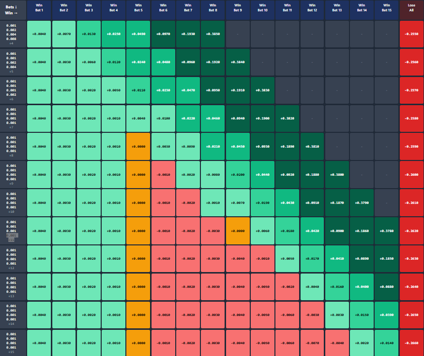

# Martingale Optimizer v5.3

A sophisticated real-time decision support system for cryptocurrency side betting on Rugs.fun, featuring advanced probability calculations, pattern detection, and martingale strategy optimization.

## 📸 Screenshots

### Mobile Dashboard

*The main Martingale Mobile Assistant Dashboard view - providing real-time game analysis and strategic recommendations*

### Developer Dashboard - Zones Tab

*The Zones tab in the developer dashboard showing the 6-zone probability framework with risk assessment visualization*

### Martingale Strategy Visualization

*Profit/loss visualization across consecutive bets using modified martingale strategies. This chart illustrates the vast permutations available when starting with a 0.001 SOL bet and using various doubling delay strategies (immediate double, wait 1 bet, wait 2 bets, etc.). The system precalculates all potential outcomes and provides players with manageable strategic choices: conservative (small but highly likely profits), moderate (balanced risk/reward), or aggressive (maximum risk/reward ratio).*

## 🚀 Features

### Core Capabilities
- **Real-time Game Analysis**: WebSocket integration for live game state tracking
- **6-Zone Probability Framework**: Advanced risk assessment (Avoid → Certainty zones)
- **Pattern Detection**: Identifies Insta-rug, Volatility Spike, Plateau, and Recovery patterns
- **Enhanced Martingale Management**: Intelligent bet sizing with Kelly Criterion
- **Live Side Bet Tracking**: Monitor all player bets in real-time
- **Sub-150ms Decision Support**: High-speed strategy recommendations

### Key Components
- 📊 **Mobile Dashboard**: Responsive UI for real-time monitoring
- 🎯 **Strategy Engine**: Multi-strategy evaluation with confidence scoring
- 💰 **Risk Management**: Automatic bet reduction at dangerous levels
- 📈 **Analytics Suite**: Performance tracking and pattern analysis
- 🏆 **Competition Tracking**: Live leaderboard and player statistics

## 📋 Prerequisites

- Node.js v14+ 
- npm or yarn
- Modern web browser (Chrome/Firefox/Safari)
- Phantom wallet (for Solana integration)

## 🛠️ Installation

1. Clone the repository:
```bash
git clone https://github.com/Dutchthenomad/martin-opt.git
cd martin-opt
```

2. Install dependencies:
```bash
npm install
```

3. Configure environment:
```bash
cp .env.example .env
# Edit .env with your configuration
```

4. Start the data collection server:
```bash
npm run server
```

5. Open the mobile dashboard:
```bash
npm run dashboard
# Opens http://localhost:3001
```

## 🎮 Usage

### Quick Start
1. Open the mobile dashboard in your browser
2. Connect to Rugs.fun WebSocket (automatic)
3. Wait for game data to populate (10-20 games)
4. Triple-tap the logo to open developer dashboard
5. Use strategy recommendations for betting decisions

### Strategy Selection
- **Conservative**: Low-risk approach with gradual progression
- **Moderate**: Balanced risk/reward ratio
- **Aggressive**: High-risk, high-reward strategy
- **Risk Management**: Activates at Level 5+ automatically

### Developer Dashboard
Access advanced features by triple-tapping the logo:
- Zone visualization and history
- Pattern detection status
- Martingale sequence tracking
- Historical game browser
- Performance analytics

## 🏗️ Architecture

```
src/
├── core/               # Core business logic
│   ├── survival_calculator.js    # Probability calculations
│   ├── enhanced_martingale_manager.js  # Bet management
│   └── ml_feature_extractor.js  # Feature extraction
├── server/             # Backend services
│   └── data-save-server.js      # Data persistence
├── ui/                 # Frontend components
│   ├── mobile-dashboard.html    # Main UI
│   └── dev-dashboard-integration.js  # Developer tools
├── analysis/           # Analysis tools
│   └── recommendation_analyzer.js  # Performance analysis
└── services/           # Service layer (planned)
    ├── unified_strategy_engine.js
    └── live_sidebet_tracker.js
```

## 📊 Data Flow

1. **WebSocket Connection** → Rugs.fun game server
2. **Event Processing** → Game state updates, side bets
3. **Probability Calculation** → Zone determination
4. **Pattern Detection** → Hidden pattern identification
5. **Strategy Evaluation** → Multi-strategy analysis
6. **Decision Presentation** → Rapid decision UI
7. **Performance Tracking** → Analytics and optimization

## 🔧 Configuration

### Environment Variables
```env
PORT=3001                    # Dashboard port
DATA_SERVER_PORT=3000        # Data collection server
SOCKET_URL=wss://backend.rugs.fun  # WebSocket endpoint
SAVE_INTERVAL=50            # Batch save interval
```

### Strategy Parameters
Edit `src/core/enhanced_martingale_manager.js`:
- `RISK_MANAGEMENT_LEVEL`: When to activate (default: 5)
- `KELLY_FRACTION`: Conservative Kelly percentage (default: 0.25)
- `EMERGENCY_PURSE_THRESHOLD`: Low purse warning (default: 0.20)

## 📈 Performance Metrics

- **Decision Latency**: < 150ms (target)
- **Probability Accuracy**: 6+ decimal precision
- **Pattern Detection**: 80%+ accuracy
- **Cache Hit Rate**: > 80% for common scenarios

## 🧪 Testing

Run unit tests:
```bash
npm test
```

Run integration tests:
```bash
npm run test:integration
```

Performance testing:
```bash
npm run test:performance
```

## 📚 Documentation

- [Integration Plan](docs/INTEGRATION_PLAN.md) - Detailed integration architecture
- [API Documentation](docs/API.md) - WebSocket and REST APIs
- [CLAUDE Instructions](docs/CLAUDE.md) - AI assistant guidelines
- [Roadmap](docs/ROADMAP.md) - Future development plans

## 🤝 Contributing

1. Fork the repository
2. Create your feature branch (`git checkout -b feature/amazing-feature`)
3. Commit your changes (`git commit -m 'Add amazing feature'`)
4. Push to the branch (`git push origin feature/amazing-feature`)
5. Open a Pull Request

## ⚠️ Disclaimer

This software is for educational and research purposes only. Cryptocurrency betting involves significant financial risk. Users are responsible for their own decisions and should never bet more than they can afford to lose.

## 📄 License

This project is licensed under the MIT License - see the [LICENSE](LICENSE) file for details.

## 🙏 Acknowledgments

- Rugs.fun for the platform and WebSocket API
- The Solana ecosystem for blockchain infrastructure
- All contributors and testers who helped improve the system

---

**Note**: This is an active research project. Features and calculations are continuously being refined based on collected data and analysis.